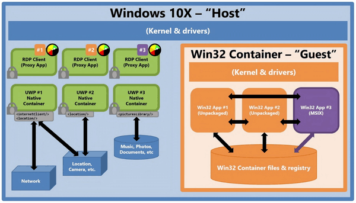

2020년 2월 12일에 마이크로소프트가 Microsoft 365 Developer Day virtual event를 통해 듀얼 스크린을 타겟으로 한 개발에 관한 웹캐스트를 진행했다.

그중에서도 그동안 자세한 정보가 공개되지 않았던 Windows 10X에 관한 정보도 공개되었다.

그동안 Windows 10X는 Windows Core OS라는 코드네임으로 마이크로소프트가 Windows RT나 10 S, S Mode를 통해 UWP만을 베이스로 하고 Win32 등의 레거시를 최대한 배제하여 깔끔하고 안정적인 모던 OS를 만들려는 시도를 계속해왔다.

Windows 10X는 기존 Win32 (레거시) 에 대한 네이티브 지원을 빼고, 컨테이너 기술을 이용해 컨테이너 안에서 Win32 앱을 실행하는 방식으로 호환성을 잡으려고 한다.

## UWP는 Host, Win32는 Guest

Windows 10X는 UWP를 전제로 만들어졌고, Win32'도' 돌릴 수 있다고 생각하면 편하다.
